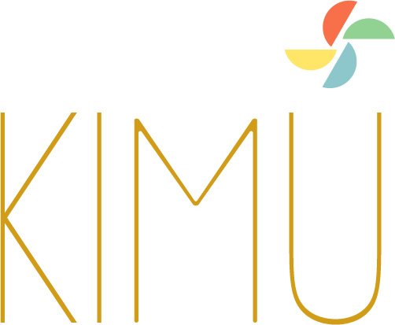

  

 
 
 

# KIMU — Keep It Minimal UI

**KIMU** è un **framework front-end** leggero, minimale, modulare e flessibile, progettato per creare interfacce utente poetiche, eleganti, **estensibili** ed efficienti con il minimo sforzo e ingombro.

È costruito con un’attenzione particolare alla **semplicità**, **intenzione**, **leggerezza**, alla **chiarezza**, alle **interazioni** significative e a **esperienze** centrate sull’essere umano — dove meno è meglio.  

Basato su **Web Components**, senza dipendenze esterne, dichiarativo e dinamico.  

Nasce per chi vuole creare applicazioni leggere, eleganti, viventi.  
Per chi progetta con **intenzione**.  
Per chi costruisce con **cura**.  
Non solo strumenti, ma spazi. Non solo componenti, ma estensioni di pensiero.

> _“Ogni estensione è un pensiero. Ogni interfaccia è un gesto.”_

Creato da  **Marco Di Pasquale** (alias *Hocram*), [UnicòVerso](https://unicoverso.com): per realizzare interfacce web leggere, eleganti e reattive.

🚀 **Per iniziare subito:**  
>  Usa il repository [`kimu-core`](https://github.com/unicoverso/kimu-core) come base per sviluppare la tua applicazione KIMU. Troverai tutto il necessario per creare estensioni, moduli e avviare un progetto minimale.

---

### 🌐 Traduzioni disponibili

- 🇬🇧 English – [README.md](./README.md)
- 🇮🇹 Italiano – [README.it.md](./README.it.md)

---

### 🔗 Link utili

- 🌐 Sito ufficiale: [unicoverso.com/kimu](https://unicoverso.com/kimu)
- 📘 Documentazione: [kimu-docs](https://github.com/unicoverso/kimu-docs)
-  Progetto core framework: [kimu-core](https://github.com/unicoverso/kimu-core)

---

## 🧠 Cos’è KIMU

`KIMU` è un **framework frontend web-native**, pensato per realizzare applicazioni modulari, interfacce sottili, ambienti flessibili.

- Creare **applicazioni leggere** con interfacce autonome, estendibili e componibili
- Build framework **100% JavaScript**
- **Web Components** nativi  
- **Nessuna dipendenza** esterna  
- **Estensioni dinamiche**, isolate, autocaricanti  
- **Sistema dichiarativo**, leggero, componibile  
- **Struttura modulare**, ispirata a una filosofia chiara e leggibile  
  

> _“Non impone: accompagna. Non grida: respira.”_

---

## ⚙️ KIMU - Caratteristiche principali

- 🌿 **Architettura ultraleggera** – Codice minimale e prestazioni ottimizzate fin dal primo byte  
- 📦 Core build meno di **20kB** – Dimensione minima per massima portabilità
- 🔧 **Componenti modulari** – Senza sovraccarichi e senza dipendenze forzate  
- ✅ **Zero dipendenze** – Sviluppato in puro JavaScript, pronto all’uso, senza librerie esterne  
- 🌐 **Cross-platform by nature** – Utilizzabile su web, desktop (Electron-like), ambienti embedded
- 🛠️ **Develop with TypeScript, Lit & Vite** – Comfort moderno per sviluppatori esperti
- 🔌 **Sistema di estensioni dinamiche** – Moduli HTML+JS+CSS autonomi e auto-caricanti  
- 🧩 **Modularità radicale** – Ogni parte può essere sostituita o disattivata  
- ⚡ **Avvio istantaneo** – Nessun processo di inizializzazione pesante  
- 🌐 **Web-native** – Basato interamente sugli standard del browser (Web Components, Custom Elements)  
- 🧱 **Componenti dichiarativi** – Le app sono costruite come somma di estensioni, senza framework esterni  
- 🎯 **Composizione al centro** – Le app sono costruite da moduli isolati e flessibili  
- 🚀 **UI minimale e pulita per esperienze web mirate** – Pensato per applicazioni web focalizzate, chioschi digitali, dashboard e interfacce essenziali  
- 💡 **For calm, not for clutter** – Meno distrazioni, più essenza
  

> "Minimal non significa povero.  
> Significa concentrarsi su ciò che conta davvero."

---

## ❓ Perché scegliere KIMU

`KIMU` è pensato per chi desidera creare **interfacce web pulite, minimali e adattive**, senza complessità superflua.  
Che tu stia realizzando un frontend leggero, un kiosk, una dashboard o un’app modulare, `KIMU` ti offre una base solida e focalizzata su cui costruire.

- 🚀 Un **framework frontend** che non ostacola il tuo flusso creativo  
- 🖥️ Crea **dashboard ultraleggere**, **interfacce kiosk** o **UI embedded**  
- 🧩 Costruisci **applicazioni autonome** con estensioni caricate dinamicamente  
- 🎛️ Prototipa **esperienze modulari e interattive** – ideali per mostre, musei o strumenti educativi  
- 🧠 Orchestra **estensioni autoconfigurabili** tramite file manifesto e metadati  
- 🧬 Costruisci **ambienti digitali personalizzabili** con comportamenti tematici  
- 🌿 Abbraccia una filosofia dove **prestazioni e semplicità** contano più della ridondanza di funzionalità  
- 🎨 Crea spazi digitali che siano **personalizzati, poetici e significativi**
  

> Una base solida per strumenti creativi, app leggere e ecosistemi modulari.

---

## 🌿 Filosofia

`KIMU` promuove un approccio al design e allo sviluppo in cui ogni elemento ha una ragione di esistere. Nessun ingombro, nessuna complessità superflua — solo funzionalità essenziale, presentata con eleganza.

`KIMU` segue il principio dell’essenzialità:

- Ogni elemento esiste perché ha un significato.  
- Ogni interazione è pensata per la chiarezza.  
- La complessità è accettata solo se serve all’utente.

- **Modulare per natura** – ogni pezzo può essere aggiunto, rimosso, combinato  
- **Minimale per scelta** – solo ciò che serve  
- **Umano per vocazione** – le interfacce sono forme di relazione
  

> "Niente appesantimenti.  
> Nessuna distrazione.  
> Solo interfacce significative."

---

## 📦 Repository principali

- [`KIMU-CORE`](https://github.com/unicoverso/kimu-core): motore runtime e gestore delle estensioni

- [`KIMU-DOCS`](https://github.com/unicoverso/kimu-docs): documentazione ed esempi  

*(Altri repository saranno collegati qui a tempo debito…)*

---

## 🚀 Come iniziare

Per iniziare puoi fare riferimento al progetto [KIMU-CORE](https://github.com/unicoverso/kimu-core). 
Puoi clonare questo repository o includere i file JS direttamente nel tuo progetto.

Documentazione ed esempi saranno presto disponibili su:  
[https://unicoverso.com/kimu/docs/index.md](https://unicoverso.com/kimu/docs)

👉 Il pacchetto `KIMU-CORE` sarà presto pubblicato su npm.  

---

## 🧩 Il cuore di KIMU: `KIMU-CORE`

[`KIMU-CORE`](https://github.com/unicoverso/kimu-core) è il nucleo del framework:  
un motore piccolo, aperto, pronto a essere esteso con moduli che rispettano una filosofia:  
**leggerezza, chiarezza, armonia**.

Offre tutto ciò che serve per avviare, caricare e orchestrare estensioni modulari, interfacce dichiarative, comportamenti reattivi e stili condivisi.

- Nessuna dipendenza imposta  
- Ogni componente è un’estensione  
- Tutto si adatta a ciò che serve e nulla di più

> Ogni interfaccia diventa un ecosistema vivo, fatto di elementi modulari che si parlano, crescono, si fondono.

---

## 🌱 Un progetto di UnicòVerso

`KIMU` è uno dei progetti di **UnicòVerso**, un laboratorio poetico di innovazione creativa. `KIMU` è nato da un’idea, un’esigenza, una visione. 

> _Costruire non solo codice,_  
> _ma strumenti leggeri per toccare il mondo digitale con umanità._

È interamente ideato, progettato e sviluppato da **Marco (Hocram) Di Pasquale**,  
all’interno del collettivo creativo **[UnicòVerso](https://unicoverso.com)**.

📍 Scopri la visione completa (sito in costruzione):  
🔗 [https://unicoverso.com](https://unicoverso.com)

📧 Contatti: [info@unicoverso.com](mailto:info@unicoverso.com)

---

## 🧭 Altri progetti in arrivo…

`KIMU` è solo l’inizio. Attorno al suo cuore cresceranno strumenti e visioni.  
Ogni progetto è un ramo, ogni ramo può fiorire.

🌿 **kimu-app-startup**  
Boilerplate minimale per iniziare da zero.  
Per chi vuole costruire la propria app con il minimo necessario e la massima chiarezza.

🖥️ **kimu-kiosk-app**  
Demo realistica di un'applicazione `KIMU` per ambienti pubblici, totem, mostre.  
Include estensioni base come orologio, meteo, slideshow.

🧪 **kimu-playground**  
Un editor visuale per creare, modificare e testare estensioni dal browser.  
Una finestra dinamica sul motore interno di `KIMU`.

🛍️ **kimu-marketplace**  
Un’interfaccia per esplorare e installare estensioni ufficiali e community.  
Un futuro ecosistema modulare, federato, libero.

📚 **kimu-docs**  
La documentazione ufficiale, scritta con chiarezza e cura.  
Per imparare `KIMU` con leggerezza.

🎨 **kimu-design-system**  
Palette, tipografia, componenti UI condivisi.  
Per garantire coerenza e bellezza tra tutte le estensioni.

🧰 **kimu-cli**  
Un piccolo strumento da terminale per creare, validare e sviluppare estensioni con pochi comandi.

---

## 🗺️ Roadmap & ToDo

Il progetto `KIMU` è vivo e in costante sviluppo.
Di seguito la nostra roadmap aggiornata, una panoramica delle funzionalità già implementate, in sviluppo o previste per il futuro.
Continua a seguirci per aggiornamenti, nuove estensioni e strumenti in arrivo.

### ✅ Completato

- [x] Core engine `kimu-core` (Web Components, estensioni dinamiche, moduli)
- [x] Build runtime JavaScript < 20kB
- [x] Sistema di estensioni caricabili dinamicamente
- [x] Script: `generate-config`, `clear:build`, `build:all-ext`
- [x] Gestione asset e manifest
- [x] Local development con Vite + Typescript
- [x] Supporto per configurazioni ambienti multipli (`dev`, `prod`, `local`, ecc.)
- [x] Notifiche, overlay, supporto modale e interfacce base
- [x] Documentazione iniziale (`get-started-en`)
- [x] Estensione `hello-app`, minimale come demo
- [x] Codice licenziato MPL-2.0
- [x] File di progetto [`README`, `LICENSE`, `CODE_OF_CONDUCT`, ecc.]
- [x] `kimu-docs`: **(work in progress)** documentazione completa online, con esempi
- [x] Gestione Moduli, Helpers e servizi
- [x] Modulo per l'internalizzazione i18n

### 🚧 In sviluppo

- [ ] `kimu-demo`: app demo con estensioni, moduli e helper
- [ ] `kimu-playground`: editor visuale di estensioni e creare estensioni JavaScript online
- [ ] `kimu-cli`: tool da terminale per generare e validare estensioni
- [ ] Design System per gestire palette colori, tipografia e componenti condivisi
- [ ] Supporto per moduli interni (`i18n`, `notification`, `state`, ecc.)
- [ ] Sistema di comunicazioni tra estensioni (`EventBus`, Servizi globali, ecc.)
- [ ] Sistema di autenticazione e sessione
- [ ] Nuove estensioni, template e demo (`clock`, `slideshow`, `weather`, ecc.)
- [ ] Esportazione estensioni (export-extension con asset e template)
- [ ] Supporto a eventi animati, motion, easing (per UI fluide)

### 🧠 Idee e funzionalità future

- [ ] Pubblicazione `KIMU-CORE` su npm
- [ ] `kimu-marketplace`: interfaccia per cercare, installare e gestire estensioni (anche community)
- [ ] Plugin per strumenti esterni (grafici, form, 3D, visione artificiale)
- [ ] Supporto per `Service Workers` e modalità offline
- [ ] Temi e skin switcher runtime
- [ ] Supporto opzionale per `SSR` o `static pre-rendering`
- [ ] Generatore di app standalone (desktop/mobile) ultra-leggere
- [ ] Test automatici e integrazione CI/CD
- [ ] Strumenti per internazionalizzazione avanzata (UI + contenuti)
- [ ] Esportazione estensioni da editor (builder GUI)

---

> `KIMU` non è un prodotto.  
> È un invito. Un'idea. Un modo per costruire software che respira.

---

## 🖋️ Licenza

Tutti i contenuti non eseguibili  del progetto `KIMU` 
(documentazione, filosofia, struttura) sono distribuiti sotto:  
[Creative Commons Attribuzione 4.0 Internazionale](./LICENSE) (CC BY 4.0).  
Puoi copiarla, modificarla e riutilizzarla, anche per scopi commerciali, citando l’autore originale.

Il codice sorgente di `KIMU`, incluso il framework `kimu-core`, 
è rilasciato sotto [Mozilla Public License 2.0 (MPL-2.0)](./LICENSE).  
Sei libero di usare, modificare e ridistribuire il codice, nel rispetto di questa licenza, 
a condizione che le modifiche ai file coperti dalla MPL restino pubbliche con la stessa licenza.

Per maggiori dettagli su attribuzione, contributi e utilizzo dei nomi, consulta il file [NOTICE](./NOTICE).

Consulta il file [`LICENSE`](./LICENSE) per tutti i dettagli.

---

## 🏷️ Nomi e attribuzioni

"KIMU", "KIMU-CORE" e "UnicòVerso" sono nomi creativi associati all'autore originale.  
Consulta il file [`NOTICE`](./NOTICE) per un uso corretto in progetti derivati.

---

  

Questo repository è la **porta d’accesso principale** all’intero ecosistema `KIMU`.  
Esplora i sottoprogetti, segui l’evoluzione e costruisci con noi un framework diverso, essenziale.

✉️ Hai idee, dubbi o semplicemente vuoi dirci cosa ne pensi?  
> Scrivici a [info@unicoverso.com](mailto:info@unicoverso.com) o apri una issue.  
> Anche solo sapere che ti interessa, per noi conta molto.

📬 Vuoi restare aggiornato su `KIMU`?  
> Segui [@UnicoVerso](https://github.com/unicoverso) su GitHub o iscriviti alla newsletter (in arrivo!).

  
  Happy coding. Gioca, crea, immagina. Benvenuto su `KIMU`.

---
